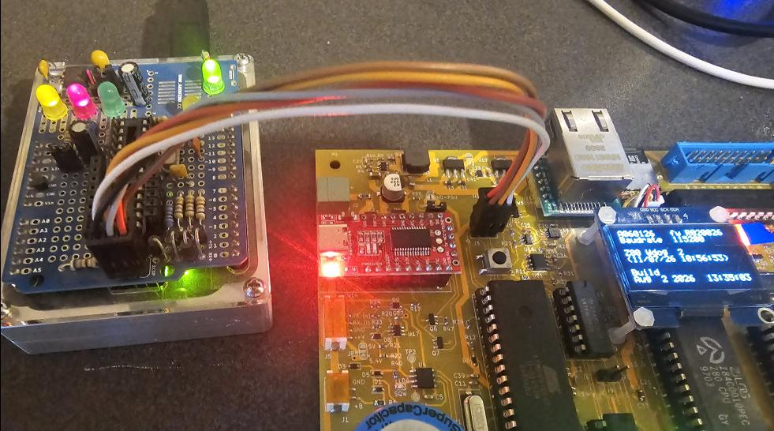
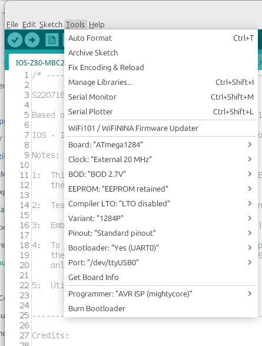

## AVR 1284P MCU Programming

This project has been tested using **Arduino IDE 1.8.19** with **MightyCore v2.2.2**, so the verified instructions provided below are related to this environment.

You can, of course, compile it from source and program it into the MCU using Arduino IDE 2.x and a more recent version of MightyCore.  

If you use a different tool version, please leave a message so the instructions for that specific setup can be added.

If your device is blank, you first need to program it using an external hardware programmer (you cannot upload the sketch directly via the serial port).

The repository provides both source code and pre-compiled .hex files (with and without a bootloader).  
The bootloader embedded in the file is **Optiboot**, configured for a **20MHz** crystal.

---

## Why MightyCore 2.2.2?

* Older versions lack functionalities required for this project (such as the ability to configure the serial buffer size)  
* Newer versions (starting from v3.x) replaced the Optiboot bootloader with Urboot, which is not compatible with IDE 1.8.19  

> [!NOTE]
> MightyCore v2.2.2 can be easily found online. A copy of the archive is also included in this repository.

Two files from the original 2.2.2 MightyCore need to be modified: `avrdude.conf` (mandatory) and `boards.txt` (recommended).

### 1. avrdude.conf
Even though MightyCore 2.2.2 is the correct core to use for IDE 1.8.19, its bundled `avrdude.conf` file was already prepared for the transition to AVRDUDE 7.x.  
It contains directives—such as `default_spi = "";`—that the AVRDUDE 6.3 interpreter cannot understand.

Replace this file with the native one from your Arduino IDE installation:
* **Source File**: `arduino-1.8.19/hardware/tools/avr/etc/avrdude.conf`
* **Destination Path**: `hardware/MightyCore/avr/avrdude.conf`

After this change, MightyCore 2.2.2 will work flawlessly with Arduino v1.8.19.

### 2. boards.txt
A modified `boards.txt` file is included in this repository with two simple, minor changes in the `1284/P` section.
If you have already customized your `boards.txt` file, do not replace it; just modify these two lines instead:

In the `1284/P` section:

* **Change the lock bits value** from `0xcf` to `0x0f` (using the older `0xCF` value would cause a non-fatal validation error):
  ```text
  #1284.bootloader.lock_bits=0xcf
  1284.bootloader.lock_bits=0x0f
  ```

* **Locate the row** `1284.menu.LTO.Os.compiler.cpp.extra_flags=` and add `-DSERIAL_RX_BUFFER_SIZE=1024`, so the line looks like:
  ```text
  1284.menu.LTO.Os.compiler.cpp.extra_flags=-DSERIAL_RX_BUFFER_SIZE=1024
  ```

This configures a larger (1KB) serial buffer size, allowing the Z80-MBC2 IOS firmware to better handle data transfers over the serial port.
IOS will recognize this flag and display the buffer size in the boot menu.

---

## Programming the MCU

For testing purposes, you may do this with a minimal hardware configuration (i.e., without the Z80, RAM, SD-CARD, Ethernet, and surrounding logic installed).  

If the board is fully populated, there is no need to unplug any component prior to programming the MCU.

In this example, an home-made `stk500v1` programmer has been used (see the picture below).

Connect your programmer to the 6-pin **J3** connector located on the right of the USB module, above the **Reset** button.  
This is the standard SPI programming connector found on almost any Arduino board.  

A small circle indicates the position of **Pin 1**, which is in the lower-left corner (brown wire in the picture).  

You probably won't need to apply power to the board, as many hardware programmers supply 5V directly to the target MCU.  




### Option A: Programming using the Arduino IDE

The only library required to compile and program this project is MightyCore (v2.2.2 for legacy Arduino 1.8.19 IDE).

1. Start the IDE and open the `IOS-MBC2V` project
2. Set the IDE according to the picture below (this screenshot shows the MightyCore v2.2.2 settings)  

3. **If you want to be (later) able to upload via USB-C serial port**: Select **Burn Bootloader** from the *Tools* menu.  
After this step, the external programmer is no longer needed.
When a bootloader is flashed, the **IOS** LED blinks to signal readiness for serial firmware upload.
Connect a USB-C cable to the serial adapter on the board, select the proper port in the IDE, and click **Upload**  

4. **If you want to flash directly via hardware programmer**: On IDE 1.8.19, hold the `SHIFT` key down while clicking the **Upload** icon.
You will need the programmer every time you upgrade the IOS firmware





### Option B: Programming from Command-Line

These examples show how to flash the pre-compiled .hex files using an `stk500v1` programmer on port `/dev/ttyACM0` at `115200` baud under Linux with AVRDUDE 6.x.  
Modify the options to suit your specific hardware setup.

First, open a command-line console and navigate to the directory above your Arduino installation.  
Copy the target .hex file into this working folder to avoid typing long paths.

#### Command for version WITHOUT the bootloader:
```sh
arduino-1.8.19/hardware/tools/avr/bin/avrdude -Carduino-1.8.19/hardware/MightyCore/avr/avrdude.conf -v -patmega1284p -cstk500v1 -P/dev/ttyACM0 -b115200 -e -Ulfuse:w:0xF7:m -Uhfuse:w:0xD7:m -Uefuse:w:0xFD:m -Ulock:w:0x3F:m -Uflash:w:IOS-Z80-MBC2-V.ino_atmega1284p_20000000L.hex:i
```

#### Command for version WITH the bootloader:
```sh
arduino-1.8.19/hardware/tools/avr/bin/avrdude -Carduino-1.8.19/hardware/MightyCore/avr/avrdude.conf -v -patmega1284p -cstk500v1 -P/dev/ttyACM0 -b115200 -e -Ulfuse:w:0xF7:m -Uhfuse:w:0xD6:m -Uefuse:w:0xFD:m -Ulock:w:0x3F:m -Uflash:w:IOS-Z80-MBC2-V.ino.with_bootloader_atmega1284p_20000000L.hex:i -Ulock:w:0x0F:m
```

---

## Pre-compiled Binaries Reference

| Filename | Description |
| :--- | :--- |
| **IOS-Z80-MBC2-V.ino_atmega1284p_20000000L.hex** | Pre-compiled firmware (20Mhz xtal) |
| **IOS-Z80-MBC2-V.ino.with_bootloader_atmega1284p_20000000L.hex** | Pre-compiled firmware with Optiboot Bootloader (20Mhz xtal) |


